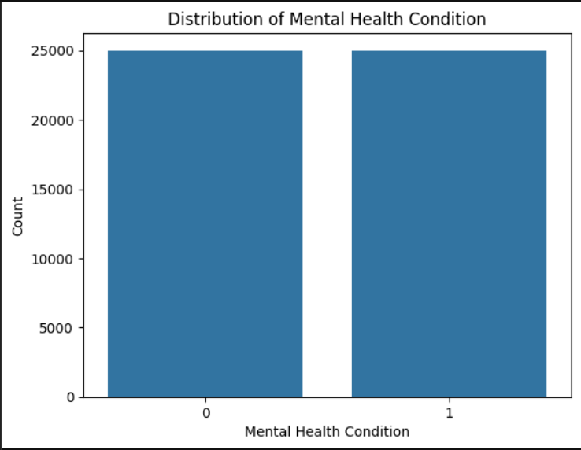
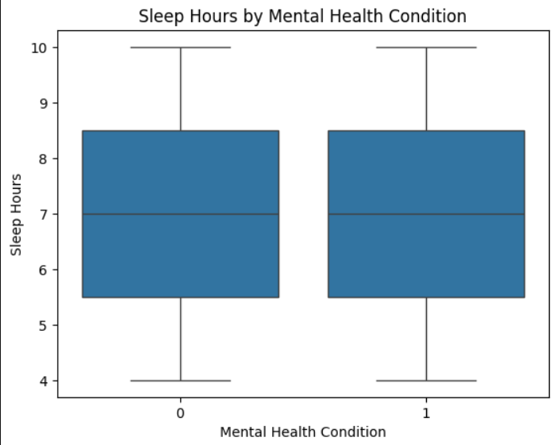
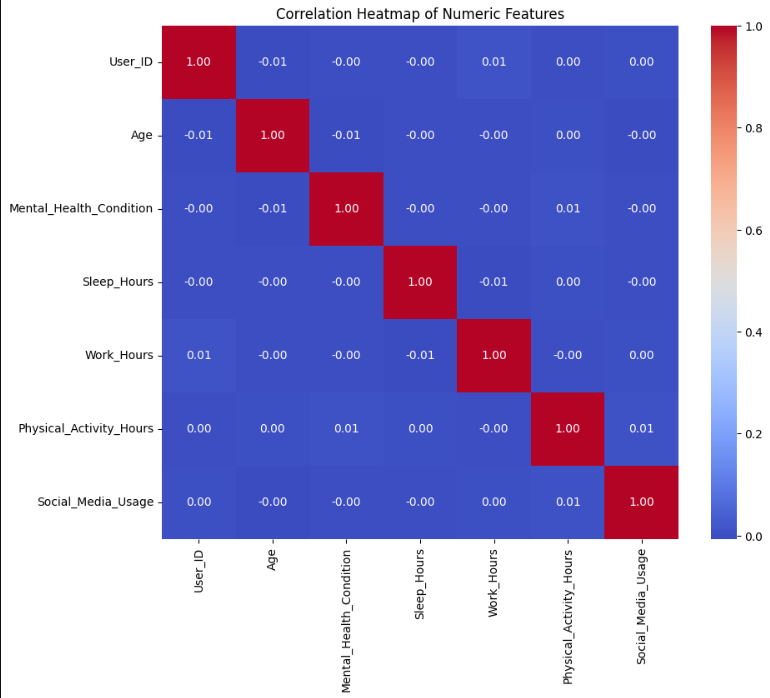
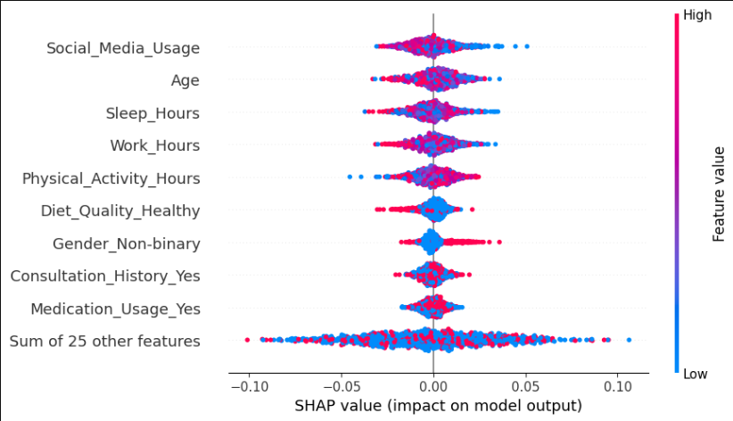
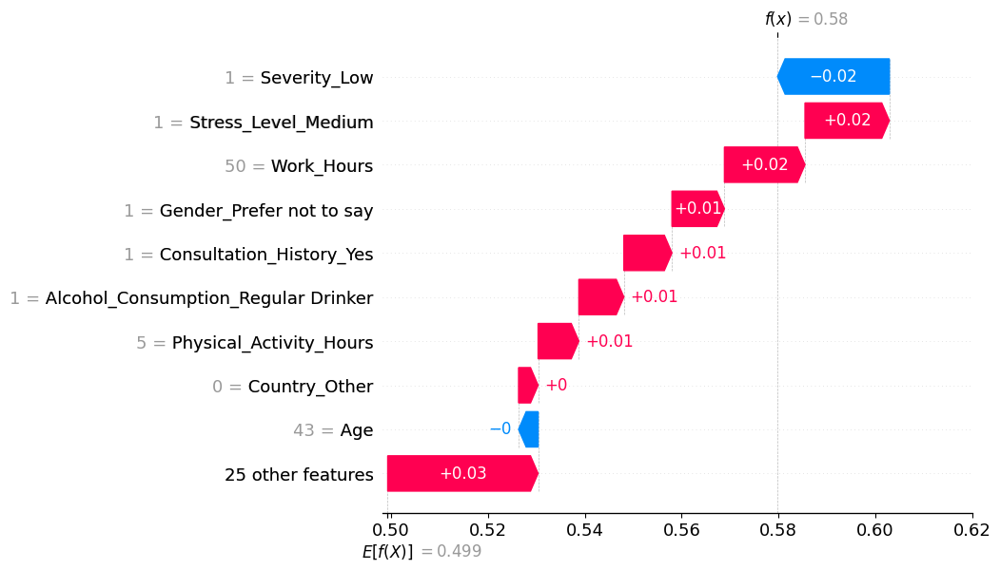
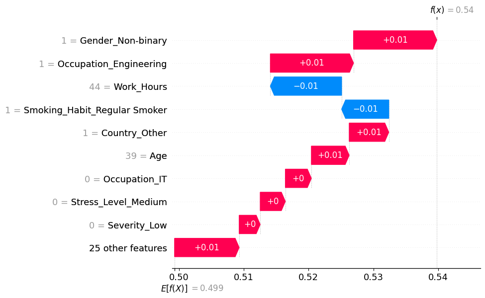
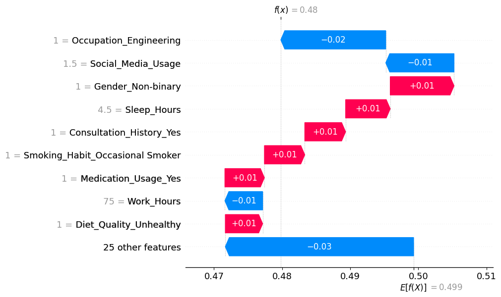
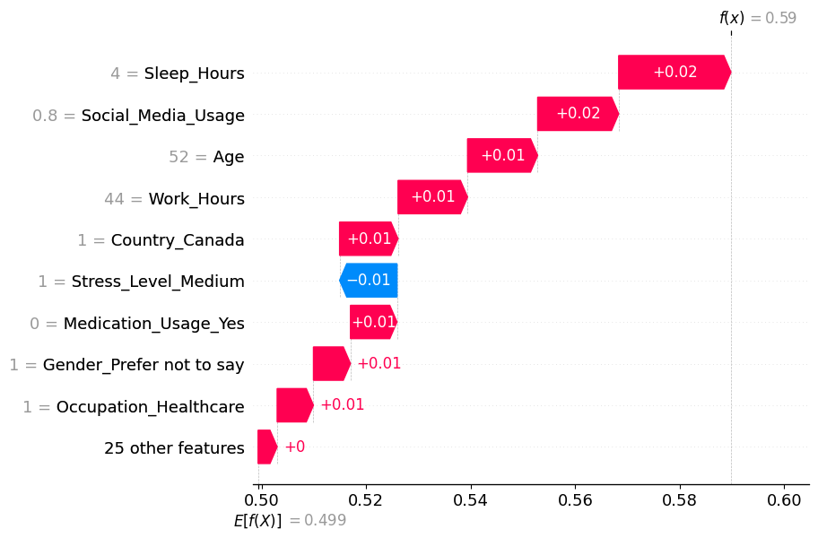
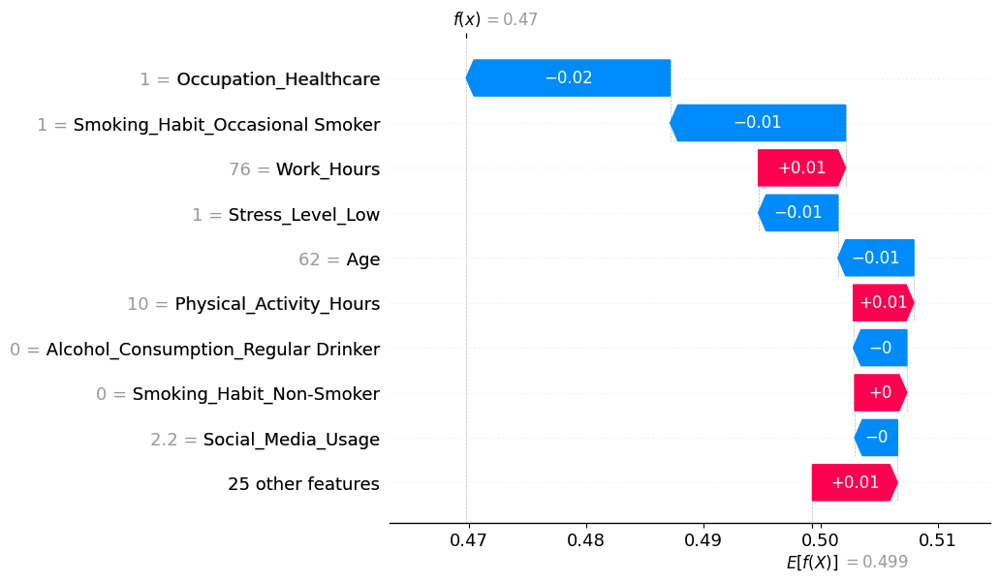

# Mental Health Lifestyle Prediction

## Overview
This project uses machine learning to predict whether an individual is at risk for a mental health condition based on their lifestyle behaviors. By analyzing factors like stress, diet, and physical activity, we aim to uncover patterns that contribute to mental health outcomes.
We trained two models - Logistic Regression and Random Forest - and used SHAP (SHapley Additive Explanations) to interpret and visualize model predicitions.

--- 

## Objetives
- Predict mental health conditions from lifestyle and demographic data
- Identify which features most influence model decisions
- Visualize and explain model behavior using SHAP

---

## Dataset
- **Title**: *Mental Health and Lifestyle Dataset for Sentiment Analysis*
- **Author**: B. Pandey (2024)
- **Source**: [Zenodo – DOI: 10.5281/zenodo.14838680](https://doi.org/10.5281/zenodo.14838680)
- **Type**: Tabular (CSV)
- **Size**: ~50,000 rows, 17 columns  
- **Target**: `Mental_Health_Condition` (`Yes`/`No`)
- **Features include**:
  - Age, Gender, Occupation
  - Sleep Hours, Stress Level, Physical Activity
  - Work Hours, Diet Quality, Social Media Usage
  - Smoking, Alcohol, Medication Usage

---

## Exploratory Data Analysis (EDA)
### Stress vs. Mental Health

### Sleep Hours Distribution by Mental Health

### Feature Correlation Heatmap

---

 ## Tools & Technologies
 - Python (Jupyter Notebook)
 - `pandas`, `numpy`, `matplotlib`, `seaborn`
 - `scikit-learn` for modeling
 - `shap` for explainability

---

## Model Summary
| Model                | Accuracy | Key Insight                              |
|---------------------|----------|-------------------------------------------|
| Logistic Regression | ~50%     | Simple baseline; struggled with complexity |
| Random Forest       | ~50%     | Slightly better separation between classes |
| SHAP                | —        | Offered feature-level interpretability     |

> Despite a balanced dataset, the models had low predictive power, showing that mental health outcomes are difficult to predict from survey-based lifestyle data alone.

---

## SHAP Explanation

### Global Feature Importance (Beeswarm Plot)
SHAP was used to interpret the overall contribution of each feature to the model’s predictions.

- SHAP values were computed for 1,000 individuals.
- Top predictive features:
  - **Age**
  - **Social Media Usage**
  - **Sleep Hours**
  - **Physical Activity**
  - **Work Hours**

---

### Local Explanations (Waterfall Plots)
Below are five example individuals, showing how specific features impacted their predicted mental health risk.  
Red bars push the prediction **higher** (toward "Yes"), and blue bars push it **lower** (toward "No").

#### Individual 1

#### Individual 2

#### Individual 3

#### Individual 4

#### Individual 5

---

### Individual Predicition Explanation (Waterfall Plot)
- Example subject (Age: 48, Sleep: 6.9 hours):
  - **Age** slightly decreased the predicted risk.
  - **Sleep Hours** slightly increased it.
- The model prediction was ~0.497, indicating low confidence.

Waterfall plots offer a detailed breakdown of each feature's contribution to the decision. Plots are included in the `visuals/` folder.

## Conclusion
This project set out to predict the presence of mental health conditions using self-reported lifestyle data. While both models performed near chance level, SHAP visualizations revealed useful patterns. Stress, sleep, diet, and screen time appear to be consistently impactful.

While prediction proved difficult, the use of model explanation techniques like SHAP helped reveal useful patterns — underscoring the role of interpretability in health-related machine learning projects.

These results emphasize the complexity of mental health prediction and highlight the need for more comprehensive or longitudinal data to build better models.
